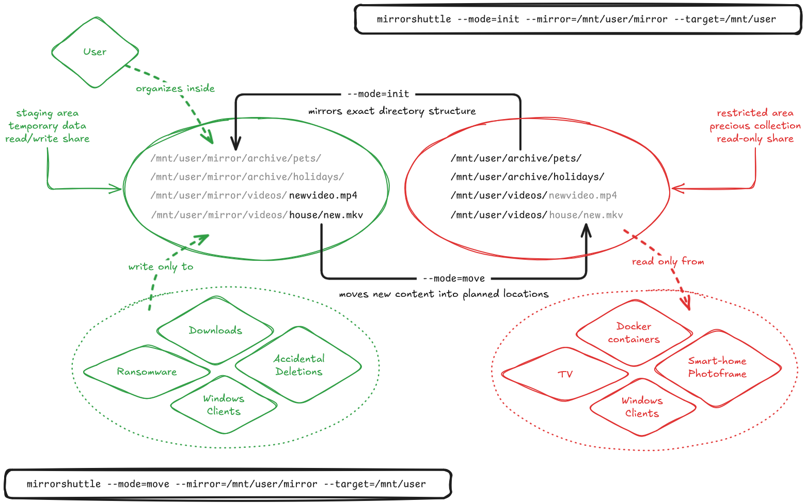

    
    <h1>MirrorShuttle</h1>
    
Keep your organization, ditch the ransomware.

    
    
    
    
    
     
    
    
    
    

<b>This software is in active development, all pre-1.0 releases should be considered experimental.</b>

 

    

#### OVERVIEW

**mirrorshuttle** is a CLI utility for safely staging and promoting filesystem
content, without exposing secure target directories to network write access. It
enables workflows similar to Samba's `vfs_worm` module, supporting a two-step
*write-once, read-many* architecture. This allows secure locations to be shared
read-only with untrusted clients, protecting these locations against ransomware,
but using their structure to safely organize and move new content from outside.

The tool operates in two main modes:

- **`init`**: Creates a mirror of the directory structure from a secure target
  into a public staging area (sandbox). This mirror is structural only (no files
  are copied) allowing you to organize where content *will go*, without
  modifying the protected destination itself from untrusted clients.

- **`move`**: Transfers newly added content from the staging mirror into the
  original secure target, preserving the intended directory layout. Files are
  moved safely, using atomic renames when possible or fallback copy-and-remove
  when necessary. Integrity is end-to-end verified via SHA-256 checksumming.

In short, this design allows untrusted clients to write files into a staging
area that mimics a secure environment's structure. Files are then promoted into
the planned protected destinations from within the server - without ever giving
clients full write access, helping defend against data tampering or ransomware.

#### FEATURES

- **Two-mode workflow**: `init` mirrors structure, `move` promotes files.
- **Secure by design**: No need for any public writes to the secure target.
- **Atomic operations**: Rename syscalls, with copy and remove fallback.
- **Checksum verification**: SHA-256 hashing ensures end-to-end integrity.
- **Exclusion rules**: Allow to skip specified absolute paths in both modes.
- **Dry-run support**: Easily preview planned operations with a `--dry-run`.
- **CLI and YAML config**: Combine structured config files with runtime flags.
- **Failure-safe**: Fails early on either misconfiguration or unsafe states.
- **Lightweight**: No root required; simply honors current user's `umask`.
- **Scriptable**: JSON output mode and return codes allow complex scripting.

#### INSTALLATION

To build from source, a Makefile is included with the project's source code.
Running `make all` will compile the application and pull in any necessary
dependencies. `make check` runs the test suite and static analysis tools.

For convenience, precompiled static binaries for common architectures are
released through GitHub. These can be installed into `/usr/bin/` or respective
system locations; ensure they are executable by running `chmod +x` before use.

#### USAGE

    mirrorshuttle --mode=init|move --mirror=ABSPATH --target=ABSPATH [flags]

#### ARGUMENTS

    --mode [init|move]
        Required. Mode of operation for the program.

        In `--mode=init` the `--mirror` directory must not contain any files, as
        it will be removed and re-created with the latest structure. If any
        files are detected, the operation will fail with a specific return code.

    --config string
        Optional. Path to a YAML configuration file with any CLI arguments.
        Exception: `--mode` argument must always be specified via command-line.
        Direct CLI arguments always override values set via configuration file.

    --mirror string
        Required. Absolute path to the mirror structure. This is where mirrored
        directories will be created and from where files will be moved. It can
        be a sub-directory of `--target`, and is excluded from being mirrored.

    --target string
        Required. Absolute path to the real (target) structure. This is the
        source of truth in init mode and the destination in move mode.

    --exclude string
        Optional. Absolute path to exclude from operations. Can be repeated.
        This prevents specified directories from being mirrored or moved.

    --direct
        Optional. Attempt atomic rename operations. If this fails (e.g., across
        filesystems), fallback to copy and remove.

        In union filesystems, this may result in allocation or disk-relocation
        methods being circumvented and files staying on the same disk despite
        that possibly not being wanted. Disable this setting for such use cases.

        Default: false

    --verify
        Optional. Re-read the target file again after moving and verify against
        a previously calculated (source file) hash, ensuring target was written
        to disk without corruption. Requires a full re-read of the target file.

        Default: false

    --skip-empty
        Optional. Do not move empty directories in `--mode=move`. This setting
        can help prevent accidental re-creation of directories which no longer
        exist in the target structure, if no files are contained (to be moved).
        Such a case can happen when the target structure has changed and it was
        forgotten to run `--mode=init` to reflect these changes on the mirror.

        Default: true

    --remove-empty
        Optional. Remove empty mirror directories in `--mode=move`; only when 
        used together with `--skip-empty` and no longer existing on the target.
        While not a replacement for a full `--mode=init`, this setting can help
        weed out no longer existing directories between any two `--mode=move`s.

        A major downside is that it also removes newly created directories
        within the mirror, those which do not contain files to be moved yet.
        Hence, using only `--skip-empty` and doing proper `--mode=init`s is to
        always be preferred over using this for cleanup purposes in production.

        Default: false

    --skip-failed
        Optional. Do not exit on non-fatal failures, skip the failed element
        and proceed instead; returns with a partial failure return code.

        Default: false

    --slow-mode
        Optional. Adds a 1 second timeout after each 50 directories created
        in `--mode=init`; helps avoid thrashing more sensitive filesystems.

        Default: false

    --init-depth int
        Optional. A numeric value that decides how deep directories are
        mirrored in `--mode=init`. A value of 0 mirrors only the contents
        of the directory root, conversely negative values impose no limit.

        Default: -1

    --dry-run
        Optional. Perform a preview of operations, without filesystem changes.
        Useful for verifying behavior before execution.

        Default: false

    --log-level [debug|info|warn|error]
        Optional. Controls verbosity of the operational logs that are emitted.

        Default: info

    --json
        Optional. Outputs in JSON format the operational logs that are emitted.
        Allows for programmatic parsing of output from standard error (stderr).

        Default: false

#### YAML CONFIGURATION EXAMPLE

    mirror: /mirror/path
    target: /real/path
    exclude:
      - /real/path/skip-this
      - /real/path/temp
    direct: false
    verify: false
    skip-empty: true
    remove-empty: false
    skip-failed: false
    slow-mode: false
    init-depth: -1
    dry-run: false
    log-level: info
    json: false

For convenience, a default configuration is provided within the repository.
Invalid configurations (unknown or malformed fields) are rejected at runtime.

#### RETURN CODES

  - `0`: Success
  - `1`: Failure
  - `2`: Partial Failure (with `--skip-failed`)
  - `3`: Mirror directory contains unmoved files (with `--mode=init`)
  - `4`: Unmoved files due to conflicting target files (with `--mode=move`)
  - `5`: Invalid command-line arguments and/or configuration file provided

#### IMPLEMENTATION

An example implementation could be a NAS system that has all user "shares"
inside `/mnt/user`, but only `/mnt/user/incoming` writable from the outside
world (e.g., via Samba). The other directories of `/mnt/user` are read-only to
the public and are themselves readable data archives that do not change.

The user wants to prepare data within the `/mnt/user/incoming` structure,
but also organize where it will end up in the protected archival structures
eventually, so they run the following initial command:

    mirrorshuttle --mode=init --mirror=/mnt/user/incoming --target=/mnt/user

The above command mirrors the `/mnt/user` structure into their staging location.
New content is added there daily, and so a periodic cron job is set up to run:

    mirrorshuttle --mode=move --mirror=/mnt/user/incoming --target=/mnt/user

Whenever the cron job runs, any new content is moved to the respective location.

If the `--target` location never changes outside of mirrorshuttle's operation,
normally no `--mode=init` would need to be run again (after the first time).

But, the user does an occasional cleanup within their archival site directly and
hence runs the initialization command (again) after finishing their cleanup:

    mirrorshuttle --mode=init --mirror=/mnt/user/incoming --target=/mnt/user

They could even run this command as part of their cron job, after the
`--mode=move` operation, ensuring that their mirror is always up to date. 

They understand that if directories were removed in the `--target` structure,
and `--mode=init` was not run again before the next `--mode=move`, any removed
directories would be re-created. This is why `--target` locations should remain
static and not be modified without a follow-up re-running of `--mode=init`.

#### DESIGN CHOICES AND LIMITATIONS

mirrorshuttle assumes the `--target` location to be relatively static, in which
case `--mode=init` calls should not need to be frequent (if at all). If the
target structure changes outside of mirrorshuttle's operation, `--mode=init` can
mirror again any new structural changes, but will need the `--mirror` directory
to not contain unmoved files, otherwise requiring manual resolution by the user.

If forgetting to run another `--mode=init` after the `--target` location has
changed, any since deleted folders may be recreated upon running `--mode=move`,
which can be very annoying to clean up afterwards. The program has no notion of
whether any not target-existing folder is a new folder to be moved or a deletion
which happened since the last move. This can be avoided in whole by running the
`--mode=init` after any target changes (as intended) or, as a safeguard, moving
always with the option `--skip-empty` enabled (which it defaults to, anyway).

The program is built to automate workflows as much as possible - without
compromising safety. If it cannot proceed safely, it will fail early with clear,
descriptive error messages, leaving any inconsistent directory states for the
user to inspect and resolve. This is a deliberate design decision to avoid
making assumptions about the user's data. The tool only performs operations that
are explicitly safe and in a known-consistent state. As a result, even minor
issues can cause the process to halt, but this behavior ensures users retain
full control over the outcome and can take corrective action with confidence.

The program is intentionally designed not to be run as root. All operations are
expected to be performed under a regular user account. When moving files back
into the target structure, ownership of those files will reflect the user
executing the tool. Additionally, file and directory permissions are created
respecting the environment's current `umask`, ensuring predictable behavior
across environments without requiring privileged access.

#### POSSIBLE USE CASES IN PRODUCTION

mirrorshuttle is well-suited for system automation, secure file transfers, and
complex orchestration of filesystem migration tasks. While it can be executed
directly from the command line interface (CLI), it is often most effective when
integrated into shell scripts or scheduled with cron jobs.

#### SECURITY, CONTRIBUTIONS AND LICENSING

Please report any issues via the GitHub Issues tracker. While no major features
are currently planned, contributions are welcome. Contributions should be
submitted through GitHub and, if possible, should pass the test suite and comply
with the project's linting rules. All code is licensed under the GPLv2 license.
