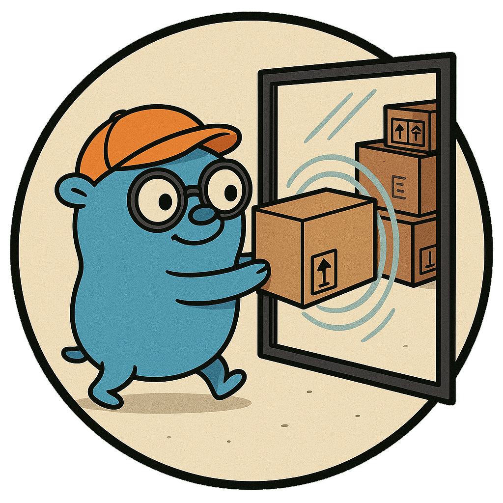

    
    <h1>MirrorShuttle</h1>
    
A utility to move from sandbox to secure storage locations.

    
    
    
    
    
    
     
    
    
    
    

#### OVERVIEW:
MirrorShuttle is a utility to move from sandbox to secure storage locations.

mirrorshuttle provides a command-line interface for replicating the full
directory structure of a target location into a sandbox or staging area. Content
can be added to this mirror structure, without exposing the secure target, but
at the benefit of having its entire directory structure available for organizing.

Later, mirrorshuttle moves new content back into the original, secured
structure, while preserving the directory structure as organized in the staging
area. This workflow allows content to be prepared in a public environment, then
securely promoted to its protected final destination, without ever exposing that
destination itself to public access.

The tool operates in two distinct operational modes, `init` and `move`:

  - `init` creates a mirror of the target directory's structure inside a sandbox
    or staging area. It excludes any paths marked with `--exclude` or otherwise
    specified in a configuration file. This is useful for preparing files in a
    public or temporary environment while using the layout of the secure
    destination. The mirror directory can even be a subdirectory of the target
    directory itself, in which case it will be excluded from the mirror process.

  - `move` transfers files that were added to the mirror back into the original
    target directory, preserving the folder structure. It ensures file integrity
    using BLAKE3 checksums and, when possible, uses atomic renames for
    efficiency. If a direct rename isn’t possible (e.g., across filesystems), it
    falls back to a safe copy-and-remove strategy.

#### FEATURES:

  - Clean CLI and YAML configuration support.
  - Optional dry-run mode for safe previews.
  - Atomic file operations when possible.
  - Safe fallback to copy-and-remove across filesystems.
  - Checksum validation using BLAKE3 to ensure in-memory integrity.
  - Exclude rules for omitting specific absolute paths from either mode.
  - Fails early on misconfiguration or unsafe directory states.

#### USAGE:

	mirrorshuttle --mode=init|move --mirror=ABSPATH --target=ABSPATH [flags]

#### ARGUMENTS:

	--mode string
		Required. Must be either "init" or "move".

		In `--mode=init` the `--mirror` folder must not contain any files, as
		it will be deleted and re-created with the latest structure. If any
		files are detected, the operation will fail with the return code `2`.

	--mirror string
		Required. Absolute path to the mirror structure. This is where mirrored
		directories will be created and from where files will be moved. It can
		be a subfolder of `--target`, and will be excluded from being mirrored.

	--target string
		Required. Absolute path to the real (target) structure. This is the
		source of truth in init mode and the destination in move mode.

	--exclude string
		Optional. Absolute path to exclude from operations. Can be repeated.
		This prevents specified directories from being mirrored or moved.

	--direct
		Optional. Attempt atomic rename operations. If this fails (e.g., across
		filesystems), fallback to copy and remove.

		In union filesystems, this may result in allocation or disk-relocation
		methods being circumvented and files staying on the same disk despite
		that possibly not being wanted. Disable this setting for such use cases.

		Default: false

	--dry-run
		Optional. Perform a preview of operations, without filesystem changes.
		Useful for verifying behavior before execution.

		Default: false

	--config string
		Path to a YAML configuration file specifying the same field names.
		CLI flags always override any values set in the configuration file.
		Exception: `--mode` argument must always be specified via command-line.

#### YAML Configuration Example:

	mirror: /mirror/path
	target: /real/path
	exclude:
	  - /real/path/skip-this
	  - /real/path/temp
	direct: true
	dry-run: false

#### RETURN CODES:

  - `0`: Success
  - `1`: Failure
  - `2`: Mirror folder contains unmoved files (cannot `--mode=init`)

#### IMPLEMENTATION:

An example implementation would be e.g., an Unraid system that has all user
"shares" inside `/mnt/user`, but only `/mnt/user/incoming` as writable from the
outside world (e.g., via Samba). The other subfolders of `/mnt/user` are not
shared to the outside world and are themselves data archives that do not change.

The user wants to prepare data within the `/mnt/user/incoming` structure only,
but also organize where it will end up in the protected archival structures
eventually, so they run the following initial command:

	mirrorshuttle --mode=init --mirror=/mnt/user/incoming --target=/mnt/user

The above command mirrors the `/mnt/user` structure into their staging location.
Content is added to the mirror structure daily, and so a periodic cron job runs:

	mirrorshuttle --mode=move --mirror=/mnt/user/incoming --target=/mnt/user

Whenever the cron job runs, any new content is moved to the respective locations.
The user does an occasional cleanup within the archival site directly and hence
runs the initialization command (again) after finishing their cleanup:

	mirrorshuttle --mode=init --mirror=/mnt/user/incoming --target=/mnt/user

They might even run this command as part of their cron job, after the respective
`--mode=move` operation, to ensure that their mirror structure is always up to
date. They understand that if folders were deleted in the `--target` structure,
and `--mode=init` was not run again before the next `--mode=move`, any deleted
folders would be re-created. This is why `--target` locations should remain
stable and not be modified without a follow-up re-running of `--mode=init`.

#### DESIGN CHOICES AND LIMITATIONS:

mirrorshuttle assumes the `--target` location to be relatively static, in which
case `--mode=init` calls should not need to be frequent (if at all). If the
target structure changes outside of mirrorshuttle's operation, `--mode=init` can
mirror again any new structural changes, but will need the `--mirror` folder to
not contain unmoved files, otherwise requiring manual resolution by the user.

The program is built to automate workflows as much as possible - without
compromising safety. If it cannot proceed safely, it will fail early with clear,
descriptive error messages, leaving any inconsistent directory states for the
user to inspect and resolve. This is a deliberate design decision to avoid
making assumptions about the user's data. The tool only performs operations that
are explicitly safe and in a known-consistent state. As a result, even minor
issues can cause the process to halt, but this behavior ensures users retain
full control over the outcome and can take corrective action with confidence.

Any important information is written to standard error (stderr), while
verbose operational information is written to standard output (stdout).

mirrorshuttle is ideal for use in system automation, secure moving, or complex
filesystem migration scenarios. Always use it with caution and ensure you
understand the behavior of the operational modes before deploying in production.
